# Evidence Pack W5: The Network Fortress

## Trần Mạnh Cường

---

## Cover

| Thông tin | Chi tiết |
| --- | --- |
| **Team** | XBrain_Group10 |
| **Tên thành viên** | Trần Mạnh Cường |
| **Tuần** | W5 - The Network Fortress (1–4 tháng 6, 2026) |
| **Deadline** | Thứ tư 04-06-2026 |
| **Link Repository** | https://github.com/tmcmanhcuong/medecu.git |
| **Evidence Pack tuần trước** | https://github.com/huyjaky/w4aws |
| **Ngày tạo** | 02-06-2026 |

---

## 1. Application Recap & Reflection

### Kiến trúc hiện tại

**Mô tả ngắn ứng dụng:**

- Tên ứng dụng: \[Ứng dụng AI chatbot\]
- Stack công nghệ: FastAPI, PostgreSQL
- Dịch vụ AI được tích hợp: Amazon Bedrock (Knowledge Base, Bedrock Agent, AWS Nova)
- Lớp lưu trữ file: Amazon EFS (medecu-efs)
- Cơ sở dữ liệu: RDS PostgreSQL (medecu-posgres)
- Backup được quản lý bởi: AWS Backup

### Ứng dụng chạy end-to-end (Live Demo)

**Action đại diện chứng minh app hoạt động:**


**Kiến trúc hệ thống trên cloud:**

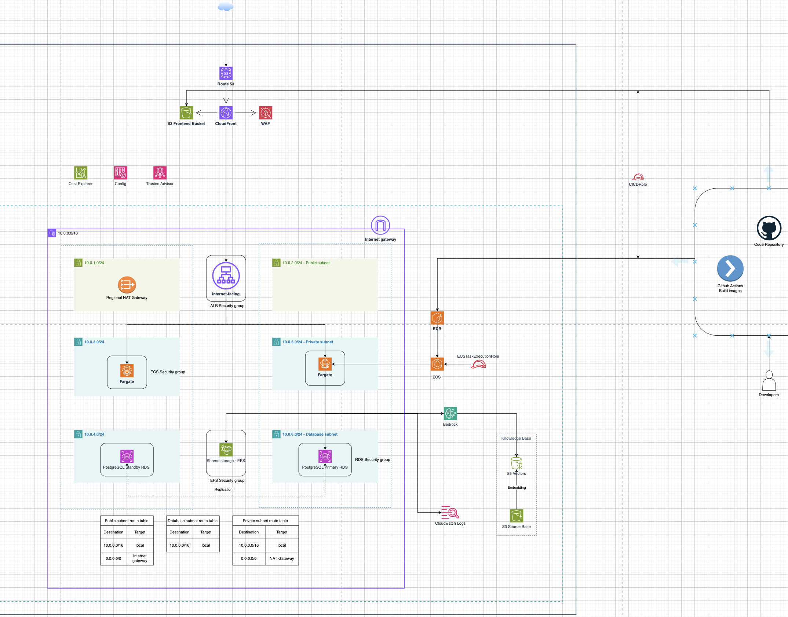

Link to diagram: https://app.diagrams.net/#G1uAov8ZokNK1LBo_zqMDtdrT4d8BFUOMf#%7B%22pageId%22%3A%22_wFuGsi9mvh8PrvmbIV1%22%7D

---

## 2. MH1 — Multi-VPC Connectivity

### Connectivity Decision: Justified Single-VPC with Multi-AZ Enhancement

**Justification cho Single-VPC:**

1. **Đơn giản hóa kiến trúc:** Ứng dụng chatbot là single-tenant SaaS không cần network isolation cấp VPC. Tất cả components (web frontend, LLM backend, database, embedding store) thuộc về cùng một ứng dụng logic.

2. **Cost-effective:** Single-VPC không cần Transit Gateway ($0.05/hour = $36/month) hay VPC peering management overhead. VPC charge vẫn flat rate $0.07/day cho single VPC.

3. **Latency thấp:** Tất cả tầng chạy cùng VPC → không có inter-VPC latency. Quan trọng cho real-time chat response (target latency &lt; 500ms từ user query tới bot answer).

4. **Easy troubleshooting:** VPC Flow Logs từ một VPC duy nhất dễ analyze hơn. Khi user báo "chatbot slow", có thể trace flow trên một VPC thay vì phải check routing giữa nhiều VPC.

5. **Không có compliance requirement:** Chatbot application không cần comply PCI-DSS (không xử lý payment cards), HIPAA (không xử lý health data), hay bất kỳ regulation nào đòi hỏi network isolation cấp VPC.

**Multi-AZ Enhancement for High Availability**:Tất cả subnet tiers được mở rộng sang **Multi-AZ** (ap-southeast-1a và ap-southeast-1b):

**Khi nào sẽ trigger Multi-VPC transition:**

1. **Multi-region deployment:** Khi mở rộng sang Singapore, Tokyo, hoặc region khác → sẽ cần VPC riêng per region + Transit Gateway global hub

2. **Separate staging/production:** Khi team scale và cần strict network isolation giữa prod (sensitive data) vs staging (test data) → sẽ tách thành VPC riêng

3. **Third-party chatbot integration:** Khi integrate với partner APIs (Slack bot marketplace, Teams integration) → sẽ cần VPC peering với partner infrastructure

4. **Compliance expansion:** Nếu sau này support healthcare/financial domain → HIPAA/PCI-DSS → sẽ cần dedicated VPC per compliance tier

5. Tổng quan kiến trúc VPC Hệ thống được triển khai trên một VPC duy nhất với tên medecu-vpc. Kiến trúc mạng được thiết kế theo mô hình phân tầng nhằm tách biệt các thành phần public, private (ECS/EFS), và database để tăng cường bảo mật và khả năng quản lý traffic.

a) Thông tin VPC:

- Tên VPC: `medecu-vpc`
- Mô hình: Single VPC Architecture
- Triển khai: Multi-AZ
- Region: ap-southeast-1


b) Thiết kế Subnet: Hệ thống sử dụng tổng cộng 6 subnet hoạt động, được phân bổ trên 2 Availability Zone:

- ap-southeast-1a
- ap-southeast-1b

Mỗi AZ bao gồm:

- Public Subnet Dùng cho Application Load Balancer (ALB) và NAT Gateway:

  - `medecu-public-a` - CIDR: `10.0.1.0/24` (AZ-a)
  - `medecu-public-b` - CIDR: `10.0.2.0/24` (AZ-b)

- Private Subnet Dùng cho ECS/Fargate tasks và EFS Mount Targets:

  - `medecu-ecs-a` - CIDR: `10.0.3.0/24` (AZ-a)
  - `medecu-ecs-b` - CIDR: `10.0.4.0/24` (AZ-b)

- Database Subnet Dùng cho Amazon RDS PostgreSQL:

  - `medecu-rds-a` - CIDR: `10.0.5.0/24` (AZ-a)
  - `medecu-rds-b` - CIDR: `10.0.6.0/24` (AZ-b)

c) Route Tables: Hệ thống sử dụng 3 route table riêng biệt để quản lý traffic cho từng loại subnet:

- **Public Route Table:** `medecu-rt-public`

  

*Chức năng:* Định tuyến internet outbound traffic (`0.0.0.0/0`) trực tiếp thông qua Internet Gateway (`medecu-igw`).

- **Private Route Table:** `medecu-rt-ecs`

  

*Chức năng:* Chuyển toàn bộ outbound traffic (`0.0.0.0/0`) từ các Private App Subnet tới NAT Gateway (`medecu-natgw`) để ECS tasks kết nối an toàn ra các API/dịch vụ ngoài (như S3, Bedrock).

- **Database Route Table:** `medecu-rt-database`

  

*Chức năng:* Tách biệt hoàn toàn traffic database khỏi public network (không cấu hình route outbound `0.0.0.0/0`), chỉ cho phép định tuyến nội bộ (local) trong VPC để đảm bảo an toàn bảo mật dữ liệu.

2. Network Connectivity

Hệ thống sử dụng:

- Internet Gateway

  - medecu-igw

    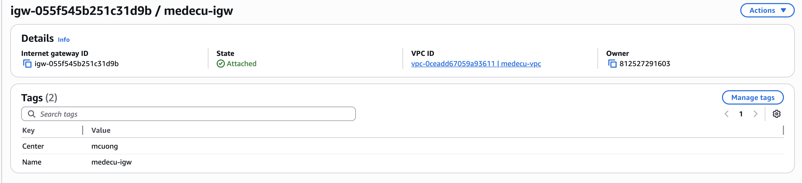

Chức năng:

- Kết nối public subnet với Internet.

- NAT Gateway

  - `medecu-natgw`

    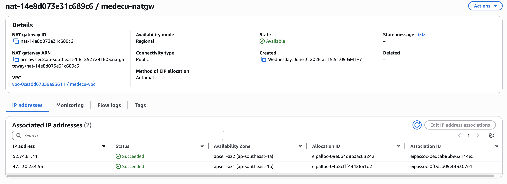

Chức năng:

- Cho phép private subnet truy cập Internet outbound mà không expose trực tiếp ra public Internet.

5. Multi-AZ Architecture

- Kiến trúc được triển khai trên 2 Availability Zone nhằm:
- Tăng tính sẵn sàng (High Availability)
- Đảm bảo khả năng chịu lỗi (Fault Tolerance)
- Giảm downtime khi một AZ gặp sự cố
- Phân phối workload hiệu quả hơn

6. Flow logs

a) VPC Flow Logs

Để giám sát và phân tích lưu lượng mạng trong hệ thống, VPC đã được cấu hình Flow Logs nhằm ghi nhận toàn bộ network traffic đi vào và đi ra khỏi VPC. Flow Logs giúp:

- Theo dõi traffic giữa các subnet

- Phân tích network connectivity

- Phát hiện traffic bất thường

- Hỗ trợ troubleshooting và security monitoring

  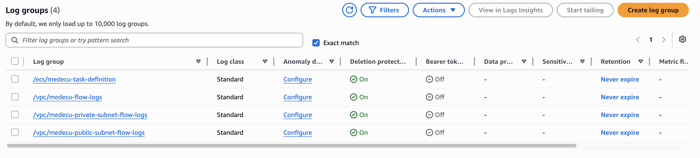

**Screenshot - VPC Flow Logs trong CloudWatch:**

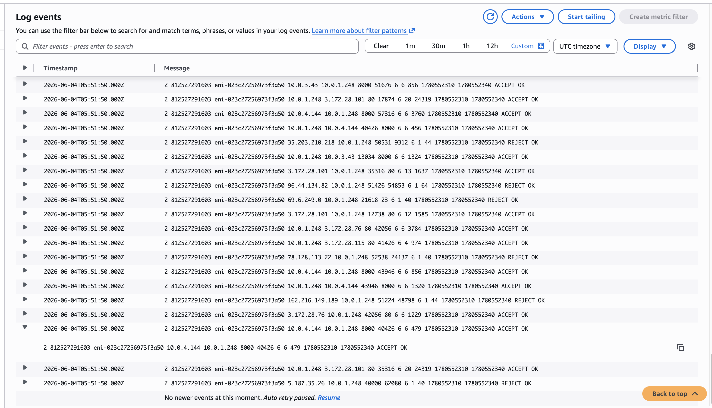

## 3. MH2 — Network Security Hardening (Bảo mật mạng & Cấu hình SG+NACL)

## Lựa chọn Path

### Path đã chọn:

☑ Path B — Security Groups & Network ACLs Hardening (Kiểm soát truy cập mạng nghiêm ngặt ở cấp độ Subnet và Instance)

> [!NOTE] 💡
> Lưu ý về AWS Network Firewall ở tài khoản Free Tier: Ban đầu em có định hướng triển khai Path A — AWS Network Firewall. Tuy nhiên, do giới hạn tài khoản AWS Free Tier / Sandbox hiện tại (gặp lỗi thiếu đăng ký dịch vụ - Subscription Required / Access Denied), em đã chuyển sang phương án bảo mật tối ưu theo Path B — Security Groups & Network ACLs Hardening.

Minh chứng lỗi không sử dụng được Network Firewall ở tài khoản Free Tier:


---

# a) Architecture Overview

Hệ thống được thiết kế theo mô hình bảo mật nhiều tầng (Defense in Depth) trực tiếp trên VPC bằng cách kết hợp chặt chẽ Security Groups và Network ACLs.

Toàn bộ outbound traffic từ private subnet được chuyển hướng trực tiếp qua NAT Gateway ra Internet, nhưng được lọc nghiêm ngặt ngay từ cổng ra của container và ở cấp độ Subnet nhằm bảo vệ an toàn cho hệ thống.

## Traffic Flow

```text
ECS Container
→ Security Group (Lọc Port & IP nguồn/đích theo Least Privilege)
→ Subnet NACL (Lọc Outbound/Inbound subnet)
→ NAT Gateway
→ Internet
```

---

# b) Security Group Hardening

Mỗi lớp tài nguyên được đặt trong một Security Group riêng biệt và chỉ cho phép lưu lượng truy cập tối thiểu cần thiết (Least Privilege):

- **ALB Security Group:** Chỉ cho phép nhận traffic HTTP (cổng `80`) và HTTPS (cổng `443`) từ Internet để định tuyến tới các container backend.
- **ECS Security Group:** Chỉ cho phép nhận traffic từ ALB Security Group qua cổng `8000`. Lưu lượng outbound chỉ được phép truy cập cổng `443` (để gọi AWS APIs, AWS Bedrock) và cổng `2049` (để mount EFS).
- **RDS Security Group:** Chỉ cho phép nhận traffic PostgreSQL (cổng `5432`) từ duy nhất ECS Security Group, ngăn chặn mọi kết nối từ bên ngoài.
- **EFS Security Group:** Chỉ cho phép cổng `2049` (NFS) từ duy nhất ECS Security Group để truy cập ổ đĩa chung.

---

# c) Network ACLs Hardening

Do Network ACLs (NACL) hoạt động theo cơ chế **Stateless** (không tự lưu trạng thái kết nối), hệ thống thiết lập các quy tắc kiểm soát chặt chẽ cho cả chiều đi (Outbound) và chiều về (Inbound) ở cấp độ Subnet để bổ sung thêm một lớp bảo vệ vững chắc bên ngoài Security Groups:

- **Subnet Public (ALB & NAT Gateway):**

  - **Inbound:**
    - Cho phép nhận traffic HTTP (`80`) và HTTPS (`443`) từ `0.0.0.0/0`.
    - Cho phép nhận dữ liệu phản hồi (cổng tạm thời `1024-65535`) từ `0.0.0.0/0`.
    - Chặn rõ ràng (Explicit Deny) cổng quản trị SSH (`22`) và RDP (`3389`) từ `0.0.0.0/0` để bảo mật tối đa.
  - **Outbound:**
    - Cho phép gửi traffic HTTP (`80`) và HTTPS (`443`) ra `0.0.0.0/0`.
    - Cho phép trả dữ liệu (cổng tạm thời `1024-65535`) ra `0.0.0.0/0`.
    - Cho phép chuyển tiếp request tới App Subnet trên port `8000` (đích đến ECS tasks).

- **Subnet ECS (Private App Subnet):**

  - **Inbound:**
    - Cho phép nhận traffic từ Public Subnet (ALB) trên port `8000`.
    - Cho phép nhận dữ liệu phản hồi (cổng tạm thời `1024-65535`) từ `0.0.0.0/0` (phản hồi từ RDS, EFS, NAT Gateway và các dịch vụ AWS APIs).
  - **Outbound:**
    - Cho phép gửi traffic tới Database Subnet trên port `5432`.
    - Cho phép gửi traffic HTTP (`80`) và HTTPS (`443`) đi ra Internet qua NAT Gateway.
    - Cho phép phản hồi traffic (cổng tạm thời `1024-65535`) ngược về Public Subnet (đích đến ALB).

- **Subnet Database (Private DB Subnet):**

  - **Inbound:** Chỉ cho phép cổng PostgreSQL (`5432`) đi vào từ dải CIDR của Subnet ECS, chặn toàn bộ các dải IP khác.
  - **Outbound:** Chỉ cho phép phản hồi dữ liệu truy vấn (cổng tạm thời `1024-65535`) đi ra dải CIDR của Subnet ECS, không cho phép kết nối ra Internet.

---

# d) Cảnh báo & Giám sát (Monitoring)

Toàn bộ lưu lượng mạng giữa các Security Groups và Subnets được ghi nhận chi tiết qua VPC Flow Logs và được giám sát thông qua CloudWatch Logs. Điều này giúp phát hiện sớm các hành vi truy cập trái phép hoặc cấu hình sai lệch.

## 4. MH3 — File Storage Layer + Backup Plan (Chia sẻ data, bảo vệ state)

### File Storage - Amazon EFS

#### Cấu hình EFS

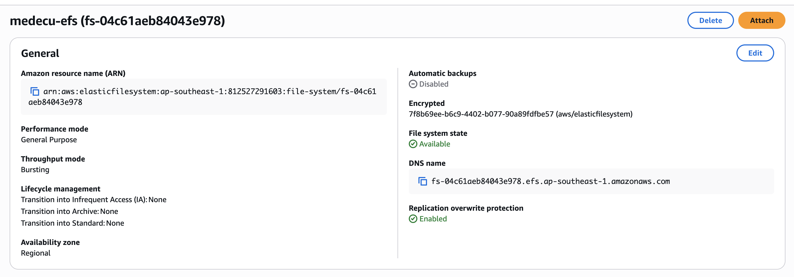

| Thông tin | Chi tiết |
| --- | --- |
| **Tên** | medecu-efs |
| **Region** | ap-southeast-1 |
| **Performance Mode** | General Purpose |
| **Throughput Mode** | Bursting |
| **Encryption at Rest** | ✅ Enabled (KMS) |
| **Lifecycle Policy** | Transition to IA after 30 days, Transition into Archive after 90 days |

**Mount Targets:**

| Subnet | AZ | Security Group |
| --- | --- | --- |
| `medecu-ecs-a` | ap-southeast-1a | `medecu-efs-sg` |
| `medecu-ecs-b` | ap-southeast-1b | `medecu-efs-sg` |

**Security Group của Mount Target:**

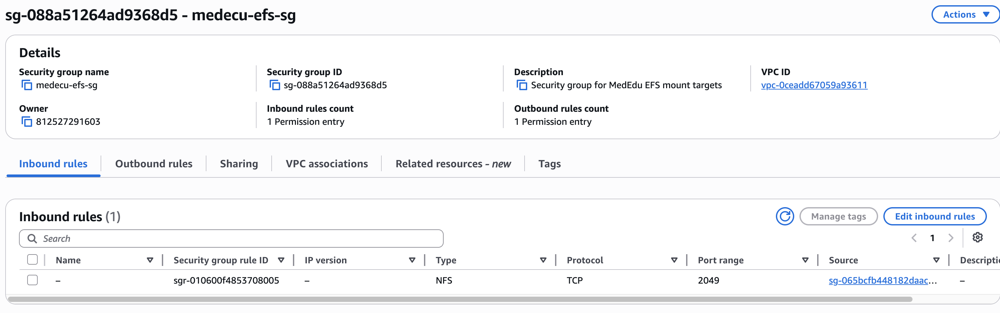

#### Mount EFS trên ECS

**Screenshot - EFS Mount Successful:**


#### Write & Read Test

Để xác minh Amazon EFS được mount và hoạt động chính xác giữa nhiều ECS tasks, em thực hiện kiểm tra ghi và đọc dữ liệu thông qua các ECS containers khác nhau.

---

#### ECS Task Definition — Mount Point Configuration

EFS được cấu hình làm shared storage và mount vào ECS containers thông qua task definition.

---

#### Screenshot — ECS Task Definition Mount Point

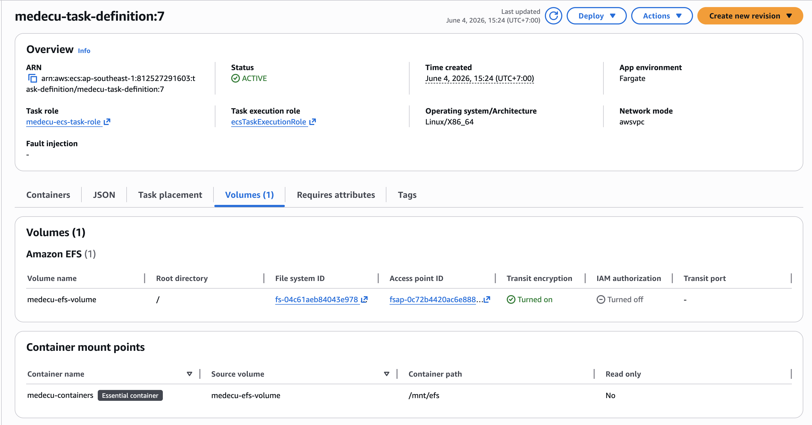

**Mô tả screenshot cần capture:**

- ECS Task Definition

- Tab Volumes hoặc Container Definitions

- Hiển thị:

  - EFS volume configuration
  - Mount point `/mnt/efs/`
  - EFS filesystem ID

---

#### Verify EFS Mounted trong ECS Container

Em truy cập vào ECS task container đầu tiên và xác nhận EFS đã được mount thành công.

Ví dụ:

```bash
mount | grep efs
```

Hoặc:

```bash
df -h
```

Kết quả cho thấy filesystem EFS đã được mount tại:

```text
/mnt/efs
```

---

#### Screenshot — EFS Mounted in First ECS Container


**Mô tả screenshot cần capture:**

- terminal bên trong container

- Hiển thị:

  - EFS mounted path
  - Mount information
  - `/mnt/efs`

---

#### Write Test — Tạo file từ ECS Container đầu tiên

Em thực hiện tạo file trực tiếp trên mounted EFS từ ECS container đầu tiên.

Ví dụ:

```bash
echo "Hello from ECS Container 1" > /mnt/efs/shared-test.txt
```

Hoặc:

```bash
touch /mnt/efs/shared-test.txt
```

Việc tạo file thành công xác nhận ECS task có quyền ghi dữ liệu vào EFS.

---

#### Screenshot — Write File to EFS


**Mô tả screenshot cần capture:**

- Terminal bên trong ECS container đầu tiên

- Hiển thị:

  - Command tạo file
  - File xuất hiện trong `/mnt/efs`

---

#### Read Test — Đọc file từ ECS Container khác

Sau khi file được tạo từ ECS container đầu tiên, em truy cập vào ECS task container thứ hai để kiểm tra khả năng chia sẻ dữ liệu qua EFS.

Ví dụ:

```bash
cat /mnt/efs/shared-test.txt
```

Expected output:

```text
Hello from ECS Container 1
```

Kết quả cho thấy file được tạo từ container đầu tiên đã xuất hiện và đọc được từ container thứ hai.

Điều này xác nhận:

- EFS đã được mount thành công trên nhiều ECS tasks
- Dữ liệu được chia sẻ real-time giữa các containers
- Amazon EFS hoạt động đúng với mô hình shared persistent storage

---

#### Screenshot — EFS Mounted in Second ECS Container


**Mô tả screenshot cần capture:**

- terminal bên trong container thứ hai

- Hiển thị:

  - `/mnt/efs`
  - Mounted EFS filesystem

---

#### Screenshot — Read File from Second Container


**Mô tả screenshot cần capture:**

- Terminal bên trong ECS container thứ hai

- Hiển thị:

  - Command:

    ```bash
    cat /mnt/efs/shared-test.txt
    ```

  - Nội dung file đọc được

  - Xác nhận file được share giữa nhiều containers

**Negative security test cho EFS: Không thể mount EFS vào EC2 instance, do security group không cho phép kết nôi từ EC2 Instance.**


**Ngược lại, nếu security group của efs cho phép kết nối từ EC2 instance thì có thể mount thành công:**


---

## Backup Plan và Restore Verification

### Tổng quan triển khai

Trong phần này, em triển khai AWS Backup để tự động backup các tài nguyên quan trọng của hệ thống nhằm đáp ứng yêu cầu disaster recovery và data protection.

Backup strategy bao gồm:

- AWS Backup Plan tự động chạy theo lịch
- Backup nhiều resource production
- Lưu recovery point trong Backup Vault
- Kiểm tra restore thực tế từ recovery point
- Xác minh dữ liệu sau restore thành công

---

### AWS Backup Plan

#### Backup Plan Information

| Thông tin | Chi tiết |
| --- | --- |
| **Backup Plan Name** | medecu-backup-plan |
| **Backup Vault** | medecu-backup-vault |
| **Status** | ✅ Active |
| **Created Time** | May 14, 2026 |
| **Schedule** | Daily Automatic Backup |
| **Backup Service** | AWS Backup |

Ngoài backup plan chính do em cấu hình, hệ thống còn có automatic backup plan mặc định cho Amazon EFS.

---

#### Existing Backup Plans

| Backup Plan | Type | Status |
| --- | --- | --- |
| **medecu-backup-plan** | Custom Backup Plan | ✅ Active |
| **aws/efs/automatic-backup-plan** | AWS Managed EFS Backup | ✅ Active |

---

#### Screenshot — Backup Plans

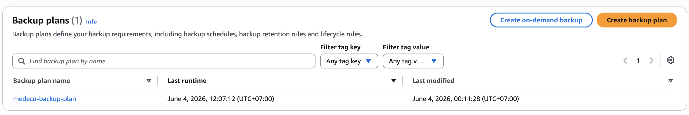

**Mô tả screenshot cần capture:**

- AWS Console → AWS Backup → Backup Plans

- Hiển thị:

  - `medecu-backup-plan`

- Hiển thị trạng thái active

- Hiển thị created time

---

### Backup Vault Configuration

#### Backup Vault

| Thông tin | Chi tiết |
| --- | --- |
| **Vault Name** | medecu-backup-vault |
| **Vault Type** | Customer Managed Vault |
| **Status** | ✅ Available |

Backup vault được sử dụng để lưu trữ recovery points của toàn bộ hệ thống.

---

#### Screenshot — Backup Vault

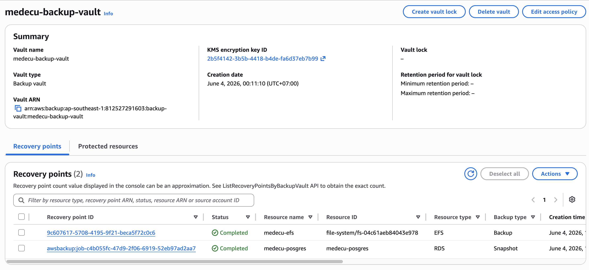

**Mô tả screenshot cần capture:**

- AWS Console → AWS Backup → Backup Vaults

- Hiển thị:

  - `medecu-backup-vault`
  - Number of recovery points
  - Vault status

---

### Resource Assignment

AWS Backup được cấu hình để backup nhiều tài nguyên production quan trọng của hệ thống.

#### Resource Assignment Information

| Thông tin | Chi tiết |
| --- | --- |
| **Resource Assignment Name** | medecu-backup-resources |
| **IAM Role** | medecu-backup-service-role |
| **Assignment Method** | ARN-based selection |

---

#### Resources được Backup

| Resource Type | Resource Name | Status |
| --- | --- | --- |
| **EFS** | `medecu-efs` | ✅ Included |
| **RDS** | `medecu-posgres` | ✅ Included |
| **S3** | `medecu-data-source` | ✅ Included |

---

#### Screenshot — Resource Assignment

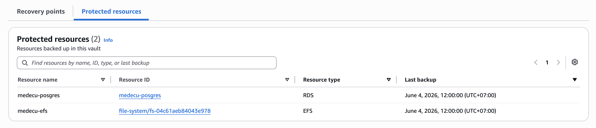

**Mô tả screenshot cần capture:**

- AWS Console → AWS Backup → Protected Resources hoặc Resource Assignments

- Hiển thị:

  - Resource assignment name
  - IAM Role
  - Danh sách resource ARN
  - EFS, RDS, S3 buckets

---

### Backup Rule Configuration

#### Backup Rule

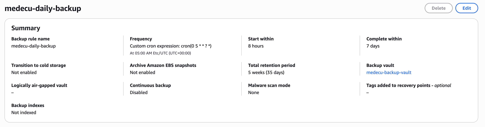

---

**Mô tả screenshot cần capture:**

| Configuration | Value |
| --- | --- |
| **Backup Rule Name** | medecu-daily-backup |
| **Backup Frequency** | Daily |
| **Backup Time** | 05:00 AM UTC (12:00 PM ICT) |
| **Start Window** | Within 8 hours |
| **Completion Window** | Within 7 days |
| **Backup Vault** | medecu-backup-vault |
| **Continuous Backup** | Enabled |
| **Total Retention Period** | 5 weeks (35 days) |

---

### Recovery Points

Sau khi backup job hoàn thành, AWS Backup tạo recovery points để phục vụ restore khi cần thiết.

#### Recovery Points Information

| Recovery Point | Resource Type | Status |
| --- | --- | --- |
| **EFS Recovery Point** | Amazon EFS | ✅ COMPLETED |
| **RDS Recovery Point** | Amazon RDS | ✅ COMPLETED |
| **S3 Recovery Point** | Amazon S3 | ✅ COMPLETED |

Recovery points được lưu trữ trong `medecu-backup-vault`.

---

#### Screenshot — Recovery Points

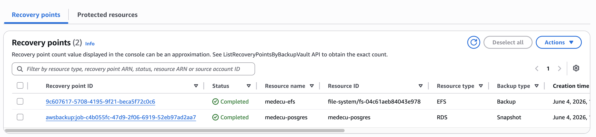

**Mô tả screenshot cần capture:**

- AWS Console → AWS Backup → Recovery Points

- Hiển thị:

  - Recovery point IDs
  - Resource type
  - Creation time
  - Status = COMPLETED
  - Backup vault name

---

### Restore Test (Bắt buộc)

Em đã thực hiện restore test từ recovery point để xác minh backup có thể sử dụng thực tế trong disaster recovery scenario.

---

### Restore Job Configuration

#### Restore Target

| Thông tin | Chi tiết |
| --- | --- |
| **Source Resource** | Amazon EFS |
| **Restore Type** | Restore to New Resource |
| **Destination** | New EFS File System |
| **Encryption** | Enabled |
| **Restore Status** | ✅ COMPLETED |

Restore test được thực hiện bằng cách khôi phục EFS từ recovery point sang file system mới.

### Restore Job Result

#### Restore Job Details

| Thông tin | Chi tiết |
| --- | --- |
| **Restore Job Status** | ✅ COMPLETED |
| **Restore Type** | EFS Restore |
| **Verification** | Success |
| **Data Validation** | Passed |

---

#### Screenshot — Restore Job Completed


**Mô tả screenshot cần capture:**

- AWS Console → AWS Backup → Restore Jobs

- Hiển thị:

  - Status = COMPLETED
  - Completion time
  - Restored resource information

---

#### Screenshot — Data Before Restore


**Mô tả screenshot cần capture:**

- Terminal hoặc file browser trước khi thực hiện restore

- Hiển thị dữ liệu hiện tại của EFS production

- Có xuất hiện file:

  - `ce4b9b45861b_handler.py`

- Thể hiện trạng thái dữ liệu mới hơn recovery point backup

---

#### Screenshot — Data After Restore


**Mô tả screenshot cần capture:**

- Terminal hoặc file browser sau khi restore EFS

- Hiển thị dữ liệu restored từ recovery point

- File:

  - `ce4b9b45861b_handler.py`
  - không xuất hiện trong restored filesystem

- Thể hiện dữ liệu đã được restore đúng theo thời điểm snapshot backup

---

#### Giải thích kết quả Restore Verification

Trước khi thực hiện restore, EFS production hiện tại có chứa file:

```text
ce4b9b45861b_handler.py
```

Tuy nhiên recovery point được tạo trước thời điểm file này tồn tại, do đó snapshot backup không bao gồm file trên.

Khi thực hiện restore, AWS Backup chỉ khôi phục dữ liệu tồn tại tại thời điểm recovery point được tạo vào restored filesystem hoặc restore directory.

Vì vậy:

- File `ce4b9b45861b_handler.py` không xuất hiện trong dữ liệu restored
- Điều này xác nhận restore operation hoạt động chính xác theo snapshot timeline
- Dữ liệu restored phản ánh đúng trạng thái filesystem tại thời điểm backup được tạo

Kết quả này chứng minh:

- Recovery point đã được sử dụng thành công
- AWS Backup restore hoạt động chính xác
- Restore không lấy dữ liệu phát sinh sau thời điểm backup
- Disaster recovery workflow được xác minh thành công

---

## Summary

| Must-Have | Status | Evidence |
| --- | --- | --- |
| **MH1 - Multi-VPC Connectivity** | ✅ COMPLETED | Single VPC with Multi-AZ + Flow Logs |
| **MH2 - Network Security / SG+NACL** | ✅ COMPLETED | SG + NACL Hardening Rules |
| **MH3 - File Storage + Backup** | ✅ COMPLETED | EFS Mount + Restore Test |

**Application Status:** ✅ Running end-to-end with W5 hardening layer

**Deployment Date:** 03-06-2026

**Verified By:** \[Trainer Name\]

---

## Revision History

| Date | Author | Changes |
| --- | --- | --- |
| 2026-05-14 | medecu | Initial Evidence Pack creation |
| 2026-05-15 | medecu | Added restore test verification |

---

**End of Evidence Pack W5**